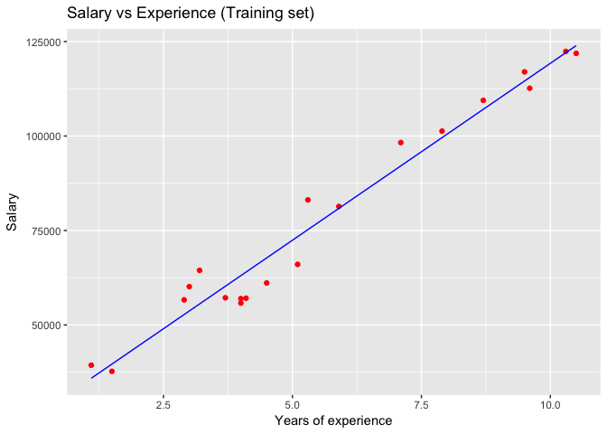

# Simple Linear Regression


### Regression - Theory
Regression analysis estimates the relationship among variables - between a dependent variable and one or more independent variables.
Regression models (both linear and non-linear) are used for predicting a real value, like salary for example. If the independent variable is time, then the model is forecasting future values, otherwise it is predicting present but unknown values. Regression technique vary from Linear Regression to SVR and Random Forests Regression.

Machine Learning Regression models:

* Simple Linear Regression
* Multiple Linear Regression
* Polynomial Regression
* Support Vector for Regression (SVR)
* Decision Tree Classification
* Random Forest Classification

### Linear Regression - Theory

In simple linear regression, we predict scores on one variable Y from the scores on a second variable X. 

Y' = bX + A

* Y Dependent Variable (DV)
* X Independent Variable (IV). Causes Y to change
* b Coefficient. Describes how a unit change in X affects Y.
* A Constant


* Pros: Works on any size of dataset, gives informations about relevance of features
* Cons: The Linear Regression Assumptions
  * A Linear Relationship between the outcome variable and the independent variables.  A plot of the standardized residuals verses the predicted Y' values show whether there is a linear or curvilinear relationship.
  * Multivariate Normality--Multiple regression assumes that the variables are normally distributed.
  * No Multicollinearity--This assumption assumes that the independent variables are not highly correlated with each other.  This assumption is tested by the Variance Inflation Factor (VIF) statistic.
  * Homoscedasticity--This assumption requires that the variance of error terms are similar across the independent variables.   As with the linear relationship assumption, Intellectus Statistics plot the standardized residuals verses the predicted Y' values can show whether points are equally distributed across all values of the independent variables or not.


### Business Problem (Udemy)

Is there a correlation between Years of Experience and Salary?

What is the best fitting line for this relationship / how should the salary be set for future employees?

Variables:
- YearsExperience
- Salary

-- Importing dataset -- 

```r
dataset = read.csv('Salary_Data.csv')
```

-- Inspecting dataset -- 

```r
head(dataset)
```

```
##   YearsExperience Salary
## 1             1.1  39343
## 2             1.3  46205
## 3             1.5  37731
## 4             2.0  43525
## 5             2.2  39891
## 6             2.9  56642
```
  
-- Splitting the dataset into a Training set and a Test set  -- 

```r
library(caTools)
set.seed(123)
split = sample.split(dataset$Salary, SplitRatio = 2/3)
training_set = subset(dataset, split == TRUE) # 20 obs.
test_set = subset(dataset, split == FALSE) # 10 obs.
```

-- Fitting Simple Linear Regression to the Training Set -- 

```r
regressor = lm(formula = Salary ~ YearsExperience, data = training_set)
summary(regressor)
```

```
## 
## Call:
## lm(formula = Salary ~ YearsExperience, data = training_set)
## 
## Residuals:
##     Min      1Q  Median      3Q     Max 
## -7325.1 -3814.4   427.7  3559.7  8884.6 
## 
## Coefficients:
##                 Estimate Std. Error t value Pr(>|t|)    
## (Intercept)        25592       2646   9.672 1.49e-08 ***
## YearsExperience     9365        421  22.245 1.52e-14 ***
## ---
## Signif. codes:  0 '***' 0.001 '**' 0.01 '*' 0.05 '.' 0.1 ' ' 1
## 
## Residual standard error: 5391 on 18 degrees of freedom
## Multiple R-squared:  0.9649,	Adjusted R-squared:  0.963 
## F-statistic: 494.8 on 1 and 18 DF,  p-value: 1.524e-14
```
Looking at coefficiants: very small p-value.

Years of Experience are highliy statistical significant -> has high impact on DV.

-- Predicting the test results --

```r
y_pred = predict(regressor, newdata = test_set)
round(y_pred)
```

```
##      2      4      5      8     11     16     20     21     24     26 
##  37767  44322  46195  55560  62116  71481  81783  89275 102386 109878
```

```r
test_set[,2]
```

```
##  [1]  46205  43525  39891  54445  63218  67938  93940  91738 113812 105582
```

-- Visualising the results -- 

```r
# Training set results
# real salaries of employees in red dots, predicted salary in blue
library(ggplot2)

ggplot() +
  geom_point(aes(x=training_set$YearsExperience, y = training_set$Salary),
             colour = 'red') +
  geom_line(aes(x=training_set$YearsExperience, y = predict(regressor, newdata = training_set)),
            colour = 'blue') +
  ggtitle('Salary vs Experience (Training set)') +
  xlab('Years of experience') + 
  ylab('Salary')
```

<!-- -->


```r
# Test set results
# real salaries (from test set) of employees in red dots, predicted salary in blue (trained on training set)
ggplot() +
  geom_point(aes(x=test_set$YearsExperience, y = test_set$Salary),
             colour = 'red') +
  geom_line(aes(x=training_set$YearsExperience, y = predict(regressor, newdata = training_set)),
            colour = 'blue') +
  ggtitle('Salary vs Experience (Test set)') +
  xlab('Years of experience') + 
  ylab('Salary')
```

<!-- -->


