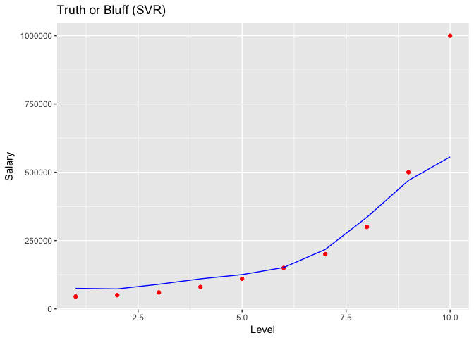

# Support Vector for Regression (SVR)


### Regression - Theory
Regression models (both linear and non-linear) are used for predicting a real value, like salary for example. If your independent variable is time, then you are forecasting future values, otherwise your model is predicting present but unknown values. Regression technique vary from Linear Regression to SVR and Random Forests Regression.

Machine Learning Regression models:

* Simple Linear Regression
* Multiple Linear Regression
* Polynomial Regression
* Support Vector for Regression (SVR)
* Decision Tree Classification
* Random Forest Classification

### SVR - Theory
Support vector machines are supervised learning models with associated learning algorithms that analyze data used for classification and regression analysis.

In addition to performing linear classification, SVMs can efficiently perform a non-linear classification using what is called the kernel trick, implicitly mapping their inputs into high-dimensional feature spaces.

* Pros: Easily adaptable, works very well on non linear problems, not biased by outliers
* Cons: Compulsory to apply feature scaling, not well known, more difficult to understand


### Business Problem (Udemy)

Interview Situation: Applicant states has 20 yrs of experience and earned 160.000 / year. Applicant has been a Region Manager for two years, half way to becoming a Partner.

HR received table with salaries per level. HR wants to predict salary of an employee with level 6.5 and find out if applicants claim is realistic.


Importing the dataset:

```r
dataset = read.csv('Position_Salaries.csv')
head(dataset)
```

```
##            Position Level Salary
## 1  Business Analyst     1  45000
## 2 Junior Consultant     2  50000
## 3 Senior Consultant     3  60000
## 4           Manager     4  80000
## 5   Country Manager     5 110000
## 6    Region Manager     6 150000
```

```r
dataset = dataset[2:3]
```

Fitting the SVR to the dataset:

```r
library(e1071)
regressor = svm(formula = Salary ~ ., 
                data = dataset,
                type = 'eps-regression') 
```
Note: 
for classification type use C-classification,
for regression type use eps-regression

Predicting a new result:

```r
y_pred = predict(regressor, data.frame(Level = 6.5))
y_pred
```

```
##        1 
## 177861.1
```

Prediction is relatively close to stated salary.


Visualising the SVR results:

```r
library(ggplot2)
ggplot() +
  geom_point(aes(x = dataset$Level, y = dataset$Salary),
             colour = 'red') +
  geom_line(aes(x = dataset$Level, y = predict(regressor, newdata = dataset)),
            colour = 'blue') +
  ggtitle('Truth or Bluff (SVR)') +
  xlab('Level') +
  ylab('Salary')
```

<!-- -->


Model fits most data points very well, except for last datapoint (for SVM this is an outlier).
