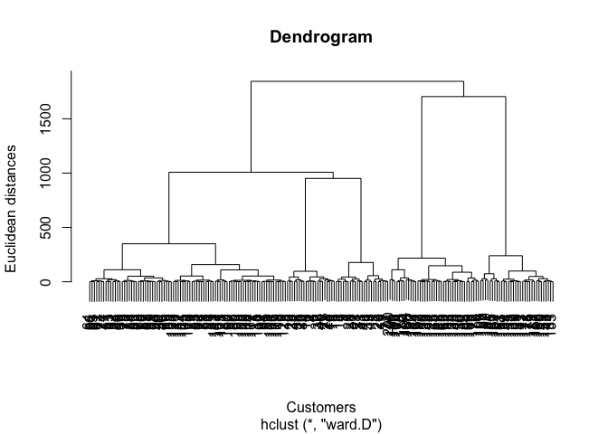
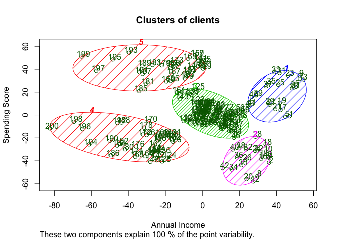

# Hierarchical Clustering


### Clustering - Theory
Clustering is similar to classification, but the basis is different. In Clustering you don’t know what you are looking for, and you are trying to identify some segments or clusters in your data. When you use clustering algorithms on your dataset, unexpected things can suddenly pop up like structures, clusters and groupings you would have never thought of otherwise.

Machine Learning Clustering models:

K-Means Clustering
Hierarchical Clustering

### Hierarchical Clustering - Theory

1. Make each datapoint a single cluster. That forms n clusters.
2. Take the two clostest data points and make theme one cluster. That forms n-1 clusters.
3. Take the two closest clusters and make them one cluster. That forms n-2 clusters.
4. Repeat step 3 until there is only one cluster. 

Dendogram shows memory of how the clusters were formed.

Euclidean distance (y-achsis) represents the dissimilarity.

We can define a certain treshhold above which the dendogram does not continue to combine clusters with the lowest dissimilarity.

Recommendation: Choose a threshold that crosses the longest vertical line.

* Pro: The optimal number of clusters can be obtained by the model itself, practical visualisation with the dendrogram
* Not appropriate for large datasets

### Business Problem (Udemy)
Segement clients in different groups based on information on their annual income and spending score

-- Importing dataset -- 

```r
dataset <- read.csv('Mall_Customers.csv')
X <- dataset[4:5]
```

-- Find optimal number of clusters using the dendrogram -- 

```r
dendrogram = hclust(dist(X, method = 'euclidean'), method = 'ward.D')
# most common method to find clusters is ward.D which tries to minimize within cluster variance
plot(dendrogram,
     main = paste('Dendrogram'),
     xlab = 'Customers',
     ylab = 'Euclidean distances')
```

<!-- -->

Ideal number of clusters: 5

-- Fitting hierarchical clustering to the mall dataset -- 

```r
hc = hclust(dist(X, method = 'euclidean'), method = 'ward.D')
y_hc = cutree(hc,5) # vector of clusters
```

-- Visualising the clusters (only for 2-dimensional clustering) -- 

```r
library(cluster)
clusplot(X,
         y_hc,
         lines = 0,
         shade = TRUE,
         color = TRUE,
         labels = 2,
         plotchar = FALSE,
         span = TRUE,
         main = paste('Clusters of clients'),
         xlab = "Annual Income",
         ylab = "Spending Score")
```

<!-- -->

Result:

* Cluster 1: High income, high spending score  ("Target clients")
* Cluster 2: High income, low spending score ("Careful clients")
* Cluster 3: Average income, average spending score ("Standard clients")
* Cluster 4: Low income, low spending score ("Sensible clients"")
* Cluster 5: Low income, high spending score ("Careless clients")
