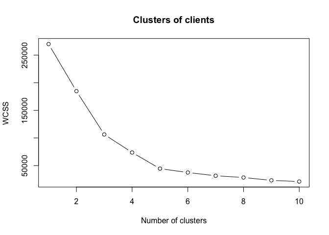
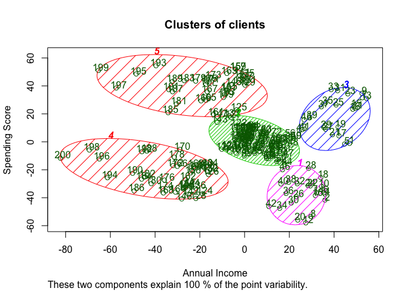

# K-Means Clustering


### Clustering - Theory
Clustering is similar to classification, but the basis is different. In Clustering you don’t know what you are looking for, and you are trying to identify some segments or clusters in your data. When you use clustering algorithms on your dataset, unexpected things can suddenly pop up like structures, clusters and groupings you would have never thought of otherwise.

Machine Learning Clustering models:

K-Means Clustering
Hierarchical Clustering

### K-Means Clustering - Theory

1. Choose number K of clusters
2. Select at random k points, the centroids (not necessarily from your dataset)
3. Assign each data point to the closest centroid - that forms K clusters
4. Compute and place the new centroid of each cluster
5. Reassign each data point to the new closest centroid. If any reassignment took place, go to to Step 4, otherweise your model is ready

* Pro: Simple to understand, easily adaptable, works well on small or large datasets, fast, efficient and performant
* Con: Need to choose the number of clusters

### Business Problem (Udemy)
Segement clients in different groups based on information on their annual income and spending score

Importing the dataset:

```r
dataset <- read.csv('Mall_Customers.csv')
X <- dataset[4:5] # Income and Spending Score
```

Find optimal number of clusters using Elbow method

```r
set.seed(6)
wcss <- vector() # iniitialize empty vector

# loop where wccs vector is populated with 10 different within-cluster sum of squares (whitinns), for the 10 number of clusters (1 to 10):
for (i in 1:10) wcss[i] <- sum(kmeans(X,i)$withinss)

plot(1:10, wcss, type = 'b', 
     main = paste('Clusters of clients'), 
     xlab = 'Number of clusters', 
     ylab = "WCSS")
```

<!-- -->

Check where is the elbow: Optimal number of clusters is 5 clusters

Applying k-means to the mall dataset

```r
set.seed(29)
kmeans <- kmeans(X,5,iter.max = 300, nstart = 10)
```

Visualising the clusters (only for 2-dimensional clustering)

```r
library(cluster)
clusplot(X,
         kmeans$cluster,      # shows which cluster point belongs to
         lines = 0,           # no distance lines should appear
         shade = TRUE,        # clusters are shaded according to density
         color = TRUE,
         labels = 2,          # have all points labeled
         plotchar = FALSE,    # no symbols
         span = TRUE,
         main = paste('Clusters of clients'),
         xlab = "Annual Income",
         ylab = "Spending Score")
```

<!-- -->

Result:

* Cluster 1: High income, low spending score ("Careful clients")
* Cluster 2: Average income, average spending scoer ("Standard clients")
* Cluster 3: High income high, spending score  ("Target clients")
* Cluster 4: Low income, low spending score ("Sensible clients"")
* Cluster 5: Low income, high spending score ("Careless clients")
