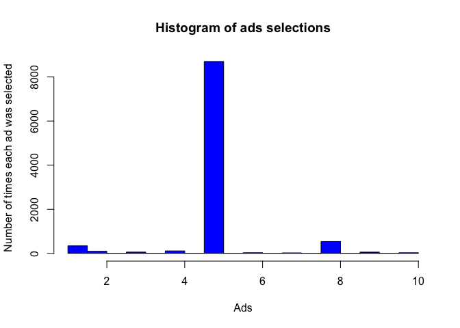

# Thompson Sampling
Lisa Hlmsch  
17 10 2017  


### Reinforcement Learning - Theory

Reinforcement Learning is a type of Machine Learning,that allows machines and software agents to automatically determine the ideal behaviour within a specific context, in order to maximize its performance. The machine is learning by trial-and-error, solely from rewards or punishments.
It is used to solve interacting problems where the data observed up to time t is considered to decide which action to take at time t + 1. It is also used for Artificial Intelligence when training machines to perform tasks such as walking. 

Reinforcement Learning models:

UCB
* Deterministic algorithm
* Requires update every round

Thompson Sampling
* Probabilistic algorithm 
* Can accommodate delayed feedback
* Better emprirical evidence


### Business Problem (Udemy)

A company has created 10 different version of an ad. The company would like to find out which veresion ad would lead to the best conversion rate / CTR (Click Through Rate).

Ads are being placed on a Social Network. Each time an ad is shown to a user it is recorded whether the user clicked on the add (success = 1 reward) or not (failure = 0 reward).
For simulation purposes, we use a dataset that represents the behaviour of 10.000 Social Network Users (1 = user clicks on ad, 0 = user does not click on ad).

The ad will not be shown to each user at random. The strategy behind reinforcement learning is that the next ad will be chosen based on the results observed before.


# Importing the dataset

```r
dataset = read.csv(paste(path,"Ads_CTR_Optimisation.csv", sep="/"))
```

# Implementing Thompson Sampling

Strategy:
At each round n, we consider two numbers for each ad i: 
* N1(n) - the number of times the ad i got reward 1 up to round n,
* N0(n) - the number of times the ad i got reward 0 up to round n.

For each ad we take a random draw from the beta distribution of parameters shape1 (number of rewards 1 +1)  and shape2 (number of rewards 0 +1). Each time we take random draw we check if the draw is higher than the max_random variable (initialized at 0). If yes it will replace the max_random variable and the ad will be added to the reward variable.

We select the ad that has the highest.


```r
set.seed(678)
N = 10000 # number of rounds
d = 10 # number of ads

ads_selected = integer(0) # contains all selected vectors at each round
numbers_of_rewards_1 = integer(d)
numbers_of_rewards_0 = integer(d)
total_reward = 0 # total reward acculmulated throughout simulation

for (n in 1:N) {
  ad = 0
  max_random = 0
  for (i in 1:d) {
    random_beta = rbeta(n = 1,
                        shape1 = numbers_of_rewards_1[i] + 1,
                        shape2 = numbers_of_rewards_0[i] + 1)
    if (random_beta > max_random) {
      max_random = random_beta
      ad = i
    }
  }
  ads_selected = append(ads_selected, ad)
  reward = dataset[n, ad]
  if (reward == 1) {
    numbers_of_rewards_1[ad] = numbers_of_rewards_1[ad] + 1
  } else {
    numbers_of_rewards_0[ad] = numbers_of_rewards_0[ad] + 1
  }
  total_reward = total_reward + reward
}
```

# Interpretation

```r
head(ads_selected,100)
```

```
##   [1]  5  4  3  2  8  5 10  6  1  5  7  9  2  6  1  2  9  2  7  8  2  7 10
##  [24]  2  8  4  5  8  5  5  5  5  5  2  8  9  6  3  1  5  5  8  7  8  2  5
##  [47]  5 10  3  6  4  5  1  5  4  5  8  7  3  5  1  9  9  8  1  5  5  5  8
##  [70]  5  5  4  1 10  9  5  8  5  5  3  5  8  2  6  4  5  5  8  3  8  4  8
##  [93]  4  8  5  5  8  8  5  5
```

During the first rounds different ads were selected. 


```r
tail(ads_selected,100)
```

```
##   [1] 5 5 5 5 5 5 5 5 5 5 5 5 5 5 5 5 5 5 5 5 5 5 5 5 5 5 5 5 5 5 5 5 5 5 5
##  [36] 5 6 5 5 5 5 5 5 5 5 5 5 5 5 5 5 5 5 5 5 5 5 8 5 5 5 5 5 5 5 5 5 5 5 5
##  [71] 5 5 5 5 5 5 5 5 5 5 5 5 5 5 5 5 5 5 5 5 5 6 5 5 5 5 5 5 5 5
```

At the end mostly ad 5 was selected. This shows that ad number 5 was the most successful. 


```r
total_reward
```

```
## [1] 2595
```

The total reward with this experiment was 2595. The goal is to to optimise this total reward. The Thomson Sampling algorithm has been more succesful than the UCB algorithm.

# Visualising the results - Histogram

```r
hist(ads_selected,
     col = 'blue',
     main = 'Histogram of ads selections',
     xlab = 'Ads',
     ylab = 'Number of times each ad was selected')
```

<!-- -->


The add with the highest conversation rate is add number 5.
