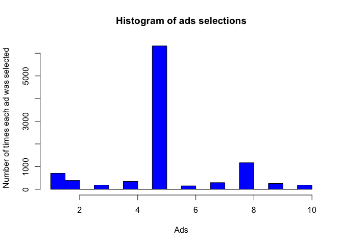

# Upper Confidence Bound
Lisa Hlmsch  
17 10 2017  


### Reinforcement Learning - Theory

Reinforcement Learning is a type of Machine Learning,that allows machines and software agents to automatically determine the ideal behaviour within a specific context, in order to maximize its performance. The machine is learning by trial-and-error, solely from rewards or punishments.
It is used to solve interacting problems where the data observed up to time t is considered to decide which action to take at time t + 1. It is also used for Artificial Intelligence when training machines to perform tasks such as walking. 

Reinforcement Learning models:

UCB

* Deterministic algorithm
* Requires update every round

Thompson Sampling

* Probabilistic algorithm 
* Can accommodate delayed feedback
* Better emprirical evidence

### Business Problem (Udemy)

A company has created 10 different version of an ad. The company would like to find out which veresion ad would lead to the best conversion rate / CTR (Click Through Rate).

Ads are being placed on a Social Network. Each time an ad is shown to a user it is recorded whether the user clicked on the add (success = 1 reward) or not (failure = 0 reward).
For simulation purposes, we use a dataset that represents the behaviour of 10.000 Social Network Users (1 = user clicks on ad, 0 = user does not click on ad).

The ad will not be shown to each user at random. The strategy behind reinforcement learning is that the next ad will be chosen based on the results observed before.


# Importing the dataset

```r
dataset = read.csv(paste(path,"Ads_CTR_Optimisation.csv", sep="/"))
```

# Implementing UCB

Strategy:
At each round n, we consider two numbers for each ad i: 
* N(n) - the number of times the ad i was selected up to round n,
* R(n) - the sum of rewards of the ad i up to round n

For these two numbers we compute the average reward of ad i up to round n, and the confidence interval at round n. 

We select the ad i that has the maximum Upper Confidence Bound.


```r
N = 10000    # number of rounds
d = 10       # number of ads

# Initialize variables
# integer(d) # vector of size d, containing only zeros
ads_selected = integer(0) # vector that shows the ads that have been selected in each round
numbers_of_selections = integer(d) # 
sums_of_rewards = integer(d) # rewards for each ad
total_reward = 0 # number of rewards that will be accumulated in each round

for (n in 1:N) {
  ad = 0
  max_upper_bound = 0
  for (i in 1:d) {
    # First we select each ad once, then implement the strategy:  
    if (numbers_of_selections[i] > 0) {
      # computes the average reward for each ad:
      average_reward = sums_of_rewards[i] / numbers_of_selections[i] 
      # computes the upper bound of the confidence interval for each ad:
      delta_i = sqrt(3/2 * log(n) / numbers_of_selections[i])
      upper_bound = average_reward + delta_i
    } else {
        # set initial upper bound to a very high level
        upper_bound = 1e400 
    }
     # computes the new highest upper bound:  
    if (upper_bound > max_upper_bound) {
      max_upper_bound = upper_bound
      ad = i 
    }
  }
  
  # update vector of ads_selected and vector of numbers_of_selections
  ads_selected = append(ads_selected, ad)
  numbers_of_selections[ad] = numbers_of_selections[ad] + 1
  
  # update vector of reward, sums_of_rewards and total_reward
  reward = as.numeric(dataset[n, ad]) # lineindex = round, columnindex = ad
  sums_of_rewards[ad] = sums_of_rewards[ad] + reward
  total_reward = total_reward + reward
}
```

# Interpretation

```r
head(ads_selected,250)
```

```
##   [1]  1  2  3  4  5  6  7  8  9 10  1  2  3  4  5  6  7  8  9 10  1  1  2
##  [24]  3  4  5  6  7  8  9  9 10  1  9  2  3  4  5  6  7  7  8  8  8 10  8
##  [47]  1  7  9  2  3  4  5  5  5  5  5  6 10  8  1  1  7  9  5  1  8  2  2
##  [70]  3  4  6 10  5  2  7  9  1  8  3  4  6 10  5  2  7  9  1  8  8  8  8
##  [93]  8  8  5  3  4  6 10  2  7  9  1  1  8  1  5  2  7  9  3  4  6 10  8
## [116]  1  5  5  5  8  8  8  8  2  7  9  3  4  6 10  1  8  8  5  8  8  8  2
## [139]  7  9  1  5  5  3  4  6 10  5  8  1  8  2  2  2  7  7  7  7  7  9  5
## [162]  3  4  6 10  8  8  8  1  7  5  2  2  2  9  8  3  4  6 10  5  1  2  2
## [185]  2  7  8  9  5  2  3  4  6 10  1  7  8  9  5  8  2  1  7  3  4  6 10
## [208]  8  8  8  8  5  5  5  5  5  8  9  2  1  7  7  7  8  5  3  4  6 10  2
## [231]  7  9  8  1  5  5  5  5  5  3  4  6 10  2  7  8  5  9  1  8
```

During the first 10 rounds each ad was selected once. 
After the first round the strategy is running and different selections appear.


```r
tail(ads_selected,250)
```

```
##   [1]  5  5  5  5  5  5  5  5  5  5  5  5  5  5  5  5  5  5  5  6  5  3 10
##  [24]  4  4  4  4  4  5  2  1  8  8  8  8  5  8  5  4  5  5  5  5  5  5  5
##  [47]  5  5  5  5  5  5  5  5  5  5  5  5  5  5  5  5  5  8  5  7  5  1  5
##  [70]  5  5  5  5  5  5  5  5  5  5  5  5  5  5  5  5  5  5  5  5  5  5  5
##  [93]  5  5  5  5  5  5  5  5  5  5  5  5  5  5  5  5  5  5  5  5  5  5  5
## [116]  5  5  5  5  5  5  5  5  5  5  5  5  5  5  5  5  5  5  5  5  5  5  5
## [139]  5  5  5  5  5  5  5  5  5  5  5  5  5  5  5  5  5  5  5  5  5  5  5
## [162]  5  5  5  5  5  5  5  5  5  5  5  5  5  5  5  5  5  5  5  5  5  5  5
## [185]  5  5  5  5  5  5  5  5  5  5  5  5  5  5  5  5  5  5  5  5  5  5  5
## [208]  5  5  5  5  5  5  5  5  5  5  5  5  5  5  5  5  5  5  5  5  5  5  5
## [231]  5  5  5  5  5  5  5  5  5  5  5  5  5  5  5  5  5  5  5  5
```

At the end more and more often ad 5 was selected. This shows that ad number 5 was the most successful. 


```r
total_reward
```

```
## [1] 2178
```

The total reward with this experiment was 2178. The goal is to to optimise this total reward. This number can be used as a reference for future experiments after the campaign has been optimized.

# Visualising the results - Histogram

```r
hist(ads_selected,
     col = 'blue',
     main = 'Histogram of ads selections',
     xlab = 'Ads',
     ylab = 'Number of times each ad was selected')
```

<!-- -->


The add with the highest conversation rate is add number 5.
