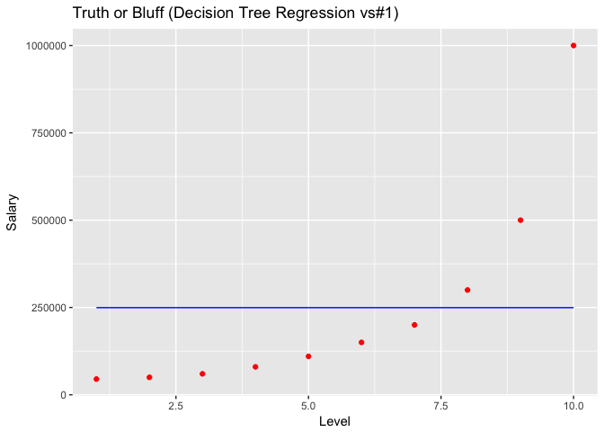
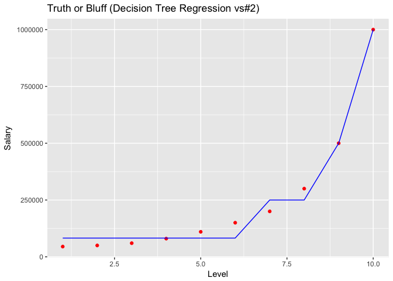
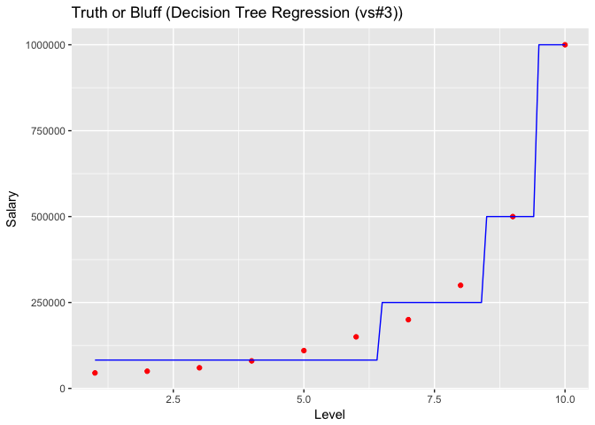
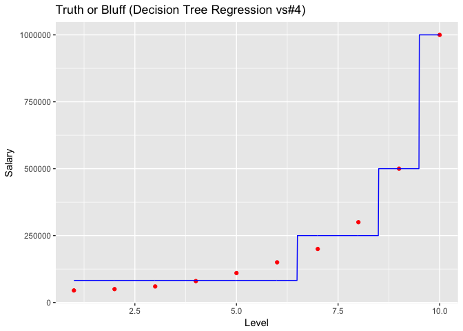

# Decision Tree Regression


### Regression - Theory
Regression analysis estimates the relationship among variables - between a dependent variable and one or more independent variables. Regression models (both linear and non-linear) are used for predicting a real value, like salary for example. If the independent variable is time, then the model is forecasting future values, otherwise it is predicting present but unknown values. Regression technique vary from Linear Regression to SVR and Random Forests Regression.

Machine Learning Regression models:

* Simple Linear Regression
* Multiple Linear Regression
* Polynomial Regression
* Support Vector for Regression (SVR)
* Decision Tree Classification
* Random Forest Classification

### Decision Tree Regression  - Theory
Decision tree learning uses a decision tree (as a predictive model) to go from observations about an item (represented in the branches) to conclusions about the item's target value (represented in the leaves)

* Pros: Interpretability, no need for feature scaling, works on both linear / nonlinear problems
* Cons: Poor results on too small datasets, overfitting can easily occur

### Business Problem (Udemy)

Interview Situation: Applicant states he earned 160.000 / year
HR received table with salaries per level
HR wants to predict salary of an employee with level 6.5 and find out if applicants claim is realistic


Importing the dataset:

```r
dataset = read.csv('Position_Salaries.csv')
head(dataset)
```

```
##            Position Level Salary
## 1  Business Analyst     1  45000
## 2 Junior Consultant     2  50000
## 3 Senior Consultant     3  60000
## 4           Manager     4  80000
## 5   Country Manager     5 110000
## 6    Region Manager     6 150000
```

```r
dataset = dataset[2:3]
```

Fitting the Decision Tree Regression to the dataset (version #1)

```r
library(rpart)
regressor = rpart(formula = Salary ~ ., data = dataset)
```

Predicting a new result:

```r
y_pred = predict(regressor, data.frame(Level = 6.5))
y_pred
```

```
## [1] 249500
```
Prediction is much higher than stated salary.


Visualising the Decision Tree Regression results (version #1)

```r
library(ggplot2)
ggplot() +
  geom_point(aes(x = dataset$Level, y = dataset$Salary), colour = 'red') +
  geom_line(aes(x = dataset$Level, y = predict(regressor, newdata = dataset)), colour = 'blue') +
  ggtitle('Truth or Bluff (Decision Tree Regression vs#1)') +
  xlab('Level') +
  ylab('Salary')
```

<!-- -->

plots straight horizontal line, which is related to the number of splits

the horizontal line is based on the average of ALL data, it is missing any splits


Fitting the Decision Tree Regression to the dataset (more robust version (vs#2))

```r
library(rpart)
regressor = rpart(formula = Salary ~ ., data = dataset, control = rpart.control(minsplit = 1))
```

-- Visualising the Decision Tree Regression results (more robust version (vs#2)) --

```r
ggplot() +
  geom_point(aes(x = dataset$Level, y = dataset$Salary),
             colour = 'red') +
  geom_line(aes(x = dataset$Level, y = predict(regressor, newdata = dataset)),
            colour = 'blue') +
  ggtitle('Truth or Bluff (Decision Tree Regression vs#2)') +
  xlab('Level') +
  ylab('Salary')
```

<!-- -->
Model is improved, there is more than one split.
However it is taking the average of each interval.
It is a non-continous model. Solution: use the model with higher resolution


Visualising the Regression Model results (for higher resolution and smoother curve (vs#3)):

```r
x_grid = seq(min(dataset$Level), max(dataset$Level), 0.1)
ggplot() +
  geom_point(aes(x = dataset$Level, y = dataset$Salary),
             colour = 'red') +
  geom_line(aes(x = x_grid, y = predict(regressor, newdata = data.frame(Level = x_grid))),
            colour = 'blue') +
  ggtitle('Truth or Bluff (Decision Tree Regression (vs#3))') +
  xlab('Level') +
  ylab('Salary')
```

<!-- -->


Even higher resolution:

```r
x_grid = seq(min(dataset$Level), max(dataset$Level), 0.01)
ggplot() +
  geom_point(aes(x = dataset$Level, y = dataset$Salary),
             colour = 'red') +
  geom_line(aes(x = x_grid, y = predict(regressor, newdata = data.frame(Level = x_grid))),
            colour = 'blue') +
  ggtitle('Truth or Bluff (Decision Tree Regression vs#4)') +
  xlab('Level') +
  ylab('Salary')
```

<!-- -->
Plot shows the average of each interval.
It is already clear that the prediction for a 6.5 Salary will be 250.000

Predicting a new result:

```r
y_pred = predict(regressor, data.frame(Level = 6.5))
y_pred
```

```
##      1 
## 250000
```


Decision Tree is not very interesting model in 1 dimension, but it is a powerful tool for several independent variables.
