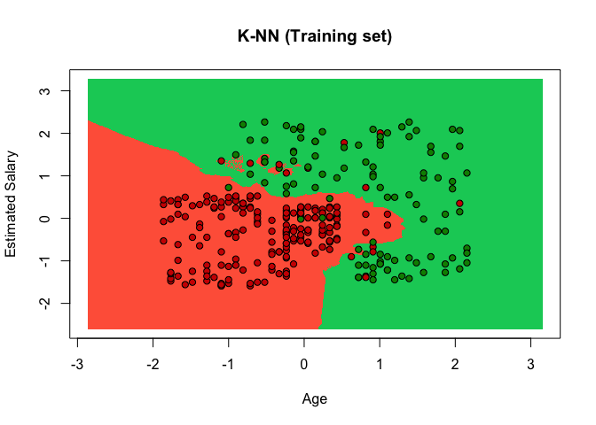
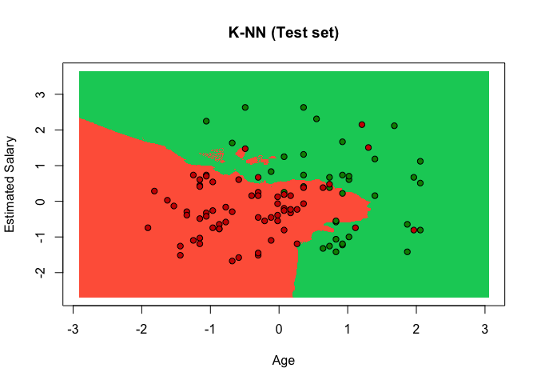

# KNN


### Classification - Theory
Unlike regression where you predict a continuous number, you use classification to predict a category. There is a wide variety of classification applications from medicine to marketing.

Machine Learning Classification models:

* Logistic Regression
* K-NN
* SVM
* Kernel SVM
* Naive Bayes
* Decision Tree Classification
* Random Forest Classification

If your problem is linear, you should go for Logistic Regression or SVM.

If your problem is non linear, you should go for K-NN, Naive Bayes, Decision Tree or Random Forest. 

Model Selection with k-Fold Cross Validation.

From a business point of view, you would rather use:

* Logistic Regression or Naive Bayes when you want to rank your predictions by their probability. For example if you want to rank your customers from the highest probability that they buy a certain product, to the lowest probability. Eventually that allows you to target your marketing campaigns. For this type of business problem, you should use Logistic Regression if your problem is linear, and Naive Bayes if your problem is non linear.

* SVM when you want to predict to which segment your customers belong to. Segments can be any kind of segments, for example some market segments you identified earlier with clustering.

* Decision Tree when you want to have clear interpretation of your model results

* Random Forest when you are just looking for high performance with less need for interpretation.

### KNN - Theory

* Pros: Works on any size of dataset, works very well on non linear problems
* Cons: Need to choose the right polynomial degree for a good bias/variance tradeoff

Steps

1. Choose the number of K neighbours
2. Take the K nearest neighbours of your new data point, according to Euclidean Distance
3. Among these K neighbours, count the number of data points in each category
4. Assign the new data point to the category where you counted the most neighbours

### Business Problem (Udemy)
Dataset includes variables on User ID, Gender, Age, Estimated Salary
One of the Social Media Pages Client, a big car company, has published an add on their site.
Social Media collected information which of their users has bought the car (1) or not (0)
Model should predict if there is a correlation between Age and Salary and the purchase behaviour.

Goal: to correctly predict if an individual user is buying the product or not

-- Importing dataset -- 

```r
dataset = read.csv('Social_Network_Ads.csv')
dataset = dataset[3:5]
```

-- Importing dataset -- 

```r
# Encoding the target feature as factor
dataset$Purchased = factor(dataset$Purchased, levels = c(0, 1))
```

-- Importing dataset -- 

```r
# Splitting the dataset into the Training set and Test set
# install.packages('caTools')
library(caTools)
set.seed(123)
split = sample.split(dataset$Purchased, SplitRatio = 0.75)
training_set = subset(dataset, split == TRUE)
test_set = subset(dataset, split == FALSE)
```

-- Feature Scaling -- 

```r
# we classify only Age and Salary (so everything except column 3)
training_set[-3] = scale(training_set[-3])
test_set[-3] = scale(test_set[-3])
```

-- Fitting K-NN Classifier to the Training set and Predicting the Test set results -- 

```r
library(class)
y_pred = knn(train = training_set[,-3],
             test = test_set[, -3],
             cl = training_set[,3],
             k = 5)
# train: trainingset without DV
# test:	testset without DV
# cl: factor of true classifications of training set = categorical DV
# k: number of neighbours considered

y_pred
```

```
##   [1] 0 0 0 0 0 1 1 1 0 0 1 0 0 0 0 0 0 0 0 0 0 0 0 1 0 1 0 0 0 1 0 0 0 0 0
##  [36] 0 0 0 0 0 0 0 0 0 0 0 0 0 0 0 0 0 1 1 1 0 1 0 0 1 0 0 0 1 1 0 1 1 1 1
##  [71] 1 1 1 0 0 0 1 0 0 1 0 1 0 1 0 1 1 0 0 1 1 0 1 0 1 1 1 1 0 1
## Levels: 0 1
```

```r
test_set[,3]
```

```
##   [1] 0 0 0 0 0 1 1 1 1 0 1 0 0 0 0 0 0 0 0 0 0 0 0 0 0 1 0 0 0 1 0 0 0 0 0
##  [36] 0 0 0 0 0 0 0 0 0 0 0 0 0 0 0 0 0 0 0 1 0 1 0 1 1 1 0 0 1 0 0 1 1 1 1
##  [71] 1 1 1 0 1 0 0 0 1 1 0 1 0 1 0 1 1 1 0 1 1 0 1 0 1 1 1 1 0 1
## Levels: 0 1
```

-- Making the Confusion Matrix -- 

```r
cm = table(test_set[, 3], y_pred)
cm
```

```
##    y_pred
##      0  1
##   0 59  5
##   1  6 30
```

* 6 + 5 = 11 false predictions
* 59 + 30 = 89 correct predictions


-- Visualising the Training set results -- 

```r
library(ElemStatLearn)
# define range of training set (X1 = Age and X2 = Salary), increased by -1, +1 so points are not squeezed in the graph
X1 = seq(min(training_set[, 1]) - 1, max(training_set[, 1]) + 1, by = 0.01)
X2 = seq(min(training_set[, 2]) - 1, max(training_set[, 2]) + 1, by = 0.01)

# create matrix
grid_set = expand.grid(X1, X2)
colnames(grid_set) = c('Age', 'EstimatedSalary')

# predict the result of each observation points, using the classifier
y_grid = knn(train = training_set[,-3],
             test = grid_set,
             cl = training_set[,3],
             k = 5)

# plot results
plot(training_set[, -3],
     main = 'K-NN (Training set)',
     xlab = 'Age', ylab = 'Estimated Salary',
     xlim = range(X1), ylim = range(X2))
contour(X1, X2, matrix(as.numeric(y_grid), length(X1), length(X2)), add = TRUE)
points(grid_set, pch = '.', col = ifelse(y_grid == 1, 'springgreen3', 'tomato'))
points(training_set, pch = 21, bg = ifelse(training_set[, 3] == 1, 'green4', 'red3'))
```

<!-- -->

-- Visualising the Test set results -- 

```r
library(ElemStatLearn)

X1 = seq(min(test_set[, 1]) - 1, max(test_set[, 1]) + 1, by = 0.01)
X2 = seq(min(test_set[, 2]) - 1, max(test_set[, 2]) + 1, by = 0.01)
grid_set = expand.grid(X1, X2)
colnames(grid_set) = c('Age', 'EstimatedSalary')
y_grid = knn(train = training_set[,-3],
             test = grid_set,
             cl = training_set[,3],
             k = 5)
plot(test_set[, -3], main = 'K-NN (Test set)',
     xlab = 'Age', ylab = 'Estimated Salary',
     xlim = range(X1), ylim = range(X2))
contour(X1, X2, matrix(as.numeric(y_grid), length(X1), length(X2)), add = TRUE)
points(grid_set, pch = '.', col = ifelse(y_grid == 1, 'springgreen3', 'tomato'))
points(test_set, pch = 21, bg = ifelse(test_set[, 3] == 1, 'green4', 'red3'))
```

<!-- -->
