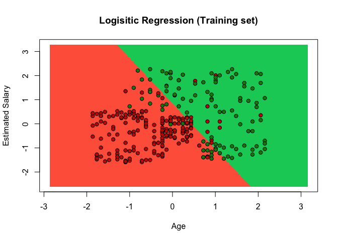
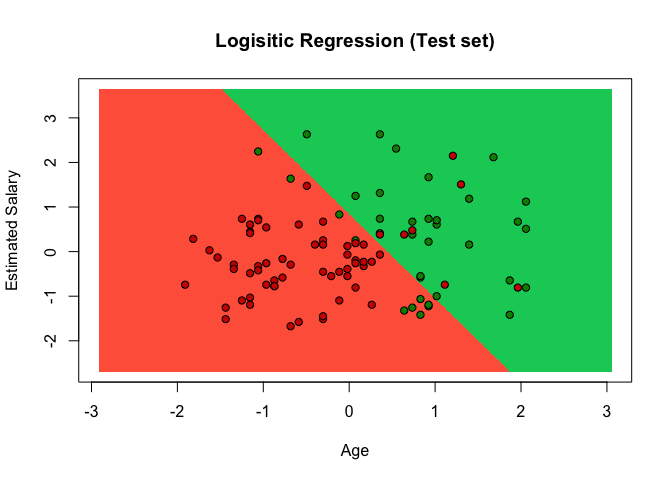

# Logistic Regression


### Classification - Theory
Unlike regression where you predict a continuous number, you use classification to predict a category. There is a wide variety of classification applications from medicine to marketing.

Machine Learning Classification models:

* Logistic Regression
* K-NN
* SVM
* Kernel SVM
* Naive Bayes
* Decision Tree Classification
* Random Forest Classification

If your problem is linear, you should go for Logistic Regression or SVM.

If your problem is non linear, you should go for K-NN, Naive Bayes, Decision Tree or Random Forest. 

Model Selection with k-Fold Cross Validation.

From a business point of view, you would rather use:

* Logistic Regression or Naive Bayes when you want to rank your predictions by their probability. For example if you want to rank your customers from the highest probability that they buy a certain product, to the lowest probability. Eventually that allows you to target your marketing campaigns. And of course for this type of business problem, you should use Logistic Regression if your problem is linear, and Naive Bayes if your problem is non linear.

* SVM when you want to predict to which segment your customers belong to. Segments can be any kind of segments, for example some market segments you identified earlier with clustering.

* Decision Tree when you want to have clear interpretation of your model results

* Random Forest when you are just looking for high performance with less need for interpretation.

### Logistic Regression - Theory

* Pros: Probabilistic approach, gives informations about statistical significance of features
* Cons: The Logistic Regression Assumptions

### Business Problem (Udemy)
Dataset includes variables on User ID, Gender, Age, Estimated Salary
One of the Social Media Pages Client, a big car company, has published an add on their site.
Social Media collected information which of their users has bought the car (1) or not (0)
Model should predict if there is a correlation between Age and Salary and the purchase behaviour.

-- Importing dataset -- 

```r
dataset = read.csv('Social_Network_Ads.csv')
dataset = dataset[, 3:5] # IV only age and Salary = index 3 and 4, DV = index 5
```

-- Splitting the dataset into the Training set and Test set -- 

```r
library(caTools)
set.seed(123)
split = sample.split(dataset$Purchased, SplitRatio = 0.75)
training_set = subset(dataset, split == TRUE)
test_set = subset(dataset, split == FALSE)
```

-- Feature Scaling -- 

```r
# We only scale Age and Salary
training_set[, 1:2] = scale(training_set[, 1:2])
test_set[,1:2] = scale(test_set[,1:2])
```

-- Fitting Logistic Regression to the Training set -- 

```r
classifier = glm(formula = Purchased ~., 
                 family = binomial,
                 data = training_set)
# family use binomial for logistic regression 
```

-- Predicting the Test set results -- 

```r
prob_pred = predict(classifier, type = 'response', newdata = test_set[-3])
# vector of predicted probabilities of our test set

# convert vector into 0 and 1 results
y_pred = ifelse(prob_pred > 0.5, 1, 0)
y_pred
```

```
##   2   4   5   9  12  18  19  20  22  29  32  34  35  38  45  46  48  52 
##   0   0   0   0   0   0   0   0   1   0   0   0   0   0   0   0   0   0 
##  66  69  74  75  82  84  85  86  87  89 103 104 107 108 109 117 124 126 
##   0   0   0   0   0   0   0   0   0   0   0   1   0   0   0   0   0   0 
## 127 131 134 139 148 154 156 159 162 163 170 175 176 193 199 200 208 213 
##   0   0   0   0   0   0   0   0   0   0   0   0   0   0   0   0   1   1 
## 224 226 228 229 230 234 236 237 239 241 255 264 265 266 273 274 281 286 
##   1   0   1   0   1   1   1   0   1   1   1   0   1   1   1   1   1   0 
## 292 299 302 305 307 310 316 324 326 332 339 341 343 347 353 363 364 367 
##   1   1   1   0   1   0   0   0   0   1   0   1   0   1   1   1   1   1 
## 368 369 372 373 380 383 389 392 395 400 
##   1   0   1   0   1   1   0   0   0   1
```

-- Making the Confusion Matrix -- 

```r
cm = table(test_set[,3], y_pred) # cm = table(vector of real values, vector of predictions)
cm
```

```
##    y_pred
##      0  1
##   0 57  7
##   1 10 26
```
* correct predictions: 57 + 26 = 83
* incorrect predictions: 10 + 7 = 17

-- Visualising the Training set results -- 

```r
library(ElemStatLearn)
# define range of training set (X1 = Age and X2 = Salary), increased by -1, +1 so points are not squeezed in the graph
X1 = seq(min(training_set[,1]) -1, max(training_set[, 1]) +1, by = 0.01) 
X2 = seq(min(training_set[,2]) -1, max(training_set[, 2]) +1, by = 0.01) # building grid with pixel points

# create matrix
grid_set = expand.grid(X1, X2) 
colnames(grid_set) = c('Age', 'EstimatedSalary')

# predict the result of each observation points, using the classifier
prob_set = predict(classifier, type = 'response', newdata = grid_set)

# convert into 0 or 1 results
y_grid = ifelse(prob_set > 0.5, 1, 0)

# plot results
plot(training_set[, -3],
    main = "Logisitic Regression (Training set)", 
    xlab = 'Age', ylab = 'Estimated Salary', 
    xlim = range(X1), ylim = range(X2))
contour(X1, X2, matrix(as.numeric(y_grid), length(X1), length(X2)), add = TRUE)
points(grid_set, pch = '.', col  = ifelse(y_grid == 1, 'springgreen3', 'tomato'))
points(training_set, pch = 21, bg = ifelse(training_set[,3] == 1, 'green4', 'red3'))
```

<!-- -->

* red points = users who did not buy SUV, green points = user who did not buy the SUV
* red surface = prediction region of non-buyers, green surface = prediction region of buyers (classifier prediction)
* Prediction boundary is the straight line dividing green and red prediction region (linear classifier)

-- Visualising the Test set results -- 

```r
X1 = seq(min(test_set[,1]) -1, max(test_set[, 1]) +1, by = 0.01)
X2 = seq(min(test_set[,2]) -1, max(test_set[, 2]) +1, by = 0.01)
grid_set = expand.grid(X1, X2)
colnames(grid_set) = c('Age', 'EstimatedSalary')
prob_set = predict(classifier, type = 'response', newdata = grid_set)
y_grid = ifelse(prob_set > 0.5, 1, 0)
plot(test_set[, -3],
     main = 'Logisitic Regression (Test set)', 
     xlab = 'Age', ylab = 'Estimated Salary', 
     xlim = range(X1), ylim = range(X2))
contour(X1, X2, matrix(as.numeric(y_grid), length(X1), length(X2)), add = TRUE)
points(grid_set, pch = '.', col  = ifelse(y_grid == 1, 'springgreen3', 'tomato'))
points(test_set, pch = 21, bg = ifelse(test_set[,3] == 1, 'green4', 'red3'))
```

<!-- -->
