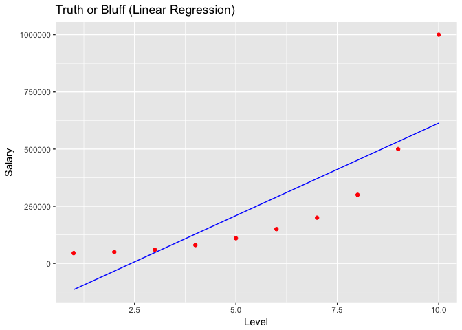
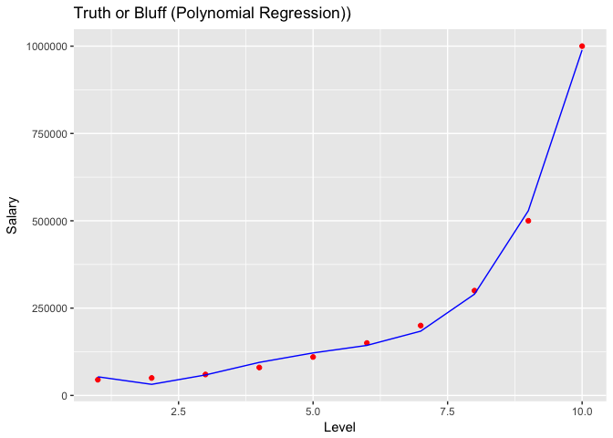

# PolynomialRegression


# Polynomial Regression

## Regression - Theory
Regression models (both linear and non-linear) are used for predicting a real value, like salary for example. If your independent variable is time, then you are forecasting future values, otherwise your model is predicting present but unknown values. Regression technique vary from Linear Regression to SVR and Random Forests Regression.

Machine Learning Regression models:

* Simple Linear Regression
* Multiple Linear Regression
* Polynomial Regression
* Support Vector for Regression (SVR)
* Decision Tree Classification
* Random Forest Classification

## Polynomial Regression - Theory
Polynomial regression is a form of regression analysis in which the relationship between the independent variable x and the dependent variable y is modelled as an nth degree polynomial in x.
Polynomial regression fits a nonlinear relationship between the value of x and the corresponding conditional mean of y

* Pros: Works on any size of dataset, works very well on non linear problems
* Cons: Need to choose the right polynomial degree for a good bias/variance tradeoff

## Business Problem (Udemy)

Interview Situation: Applicant states has 20 yrs of experience and earned 160.000 / year. Applicant has been a Region Manager for two years, half way to becoming a Partner.

HR received table with salaries per level.
HR wants to predict salary of an employee with level 6.5 and find out if applicants claim is realistic.


-- Importing dataset -- 

```r
set.seed(10)
library(ggplot2)
dataset = read.csv('Position_Salaries.csv')
head(dataset)
```

```
##            Position Level Salary
## 1  Business Analyst     1  45000
## 2 Junior Consultant     2  50000
## 3 Senior Consultant     3  60000
## 4           Manager     4  80000
## 5   Country Manager     5 110000
## 6    Region Manager     6 150000
```

```r
dataset = dataset[2:3] # only column Level and Salary
```

-- Fitting Linear Regression ot the dataset -- 

```r
# Reference base line model
lin_reg = lm(formula = Salary ~ ., data = dataset)
summary(lin_reg)
```

```
## 
## Call:
## lm(formula = Salary ~ ., data = dataset)
## 
## Residuals:
##     Min      1Q  Median      3Q     Max 
## -170818 -129720  -40379   65856  386545 
## 
## Coefficients:
##             Estimate Std. Error t value Pr(>|t|)   
## (Intercept)  -195333     124790  -1.565  0.15615   
## Level          80879      20112   4.021  0.00383 **
## ---
## Signif. codes:  0 '***' 0.001 '**' 0.01 '*' 0.05 '.' 0.1 ' ' 1
## 
## Residual standard error: 182700 on 8 degrees of freedom
## Multiple R-squared:  0.669,	Adjusted R-squared:  0.6277 
## F-statistic: 16.17 on 1 and 8 DF,  p-value: 0.003833
```

-- Fitting Polynomial Regression to the dataset --

```r
# add polynomial features (additional independent variables that are polynomial terms of this IV --> level to the power of 2,3,4) 
dataset$Level2 = dataset$Level^2
dataset$Level3 = dataset$Level^3
dataset$Level4 = dataset$Level^4

poly_reg = lm(formula = Salary ~ ., data = dataset)
summary(poly_reg)
```

```
## 
## Call:
## lm(formula = Salary ~ ., data = dataset)
## 
## Residuals:
##      1      2      3      4      5      6      7      8      9     10 
##  -8357  18240   1358 -14633 -11725   6725  15997  10006 -28695  11084 
## 
## Coefficients:
##              Estimate Std. Error t value Pr(>|t|)   
## (Intercept)  184166.7    67768.0   2.718  0.04189 * 
## Level       -211002.3    76382.2  -2.762  0.03972 * 
## Level2        94765.4    26454.2   3.582  0.01584 * 
## Level3       -15463.3     3535.0  -4.374  0.00719 **
## Level4          890.2      159.8   5.570  0.00257 **
## ---
## Signif. codes:  0 '***' 0.001 '**' 0.01 '*' 0.05 '.' 0.1 ' ' 1
## 
## Residual standard error: 20510 on 5 degrees of freedom
## Multiple R-squared:  0.9974,	Adjusted R-squared:  0.9953 
## F-statistic: 478.1 on 4 and 5 DF,  p-value: 1.213e-06
```

-- Visualising the Results --

```r
# Linear regression result
ggplot() +
  geom_point(aes(x=dataset$Level, y = dataset$Salary),
             colour = 'red') +
  geom_line(aes(x=dataset$Level, y = predict(lin_reg, newdata = dataset)),
            colour = 'blue') +
  ggtitle('Truth or Bluff (Linear Regression)') +
  xlab('Level') + 
  ylab('Salary')
```

<!-- -->


```r
# Polynom Regression result
ggplot() +
  geom_point(aes(x=dataset$Level, y = dataset$Salary),
             colour = 'red') +
  geom_line(aes(x=dataset$Level, y = predict(poly_reg, newdata = dataset)),
            colour = 'blue') +
  ggtitle('Truth or Bluff (Polynomial Regression))') +
  xlab('Level') + 
  ylab('Salary')
```

<!-- -->

-- Predicting a new result with Linear Regression --

```r
# prediction of a single level
y_pred = predict(lin_reg, data.frame(Level = 6.5))
y_pred
```

```
##        1 
## 330378.8
```


```r
# -- Predicting a new result with Polynomial Regression --
y_pred = predict(poly_reg, data.frame(Level = 6.5, 
                                      Level2 = 6.5^2,
                                      Level3 = 6.5^3,
                                      Level4 = 6.5^4))
y_pred
```

```
##        1 
## 158862.5
```

Result: Polynomial regression model fits much better. Predicted salary for level 6.5 is 158862.5 which is close to the stated 160k salary.
