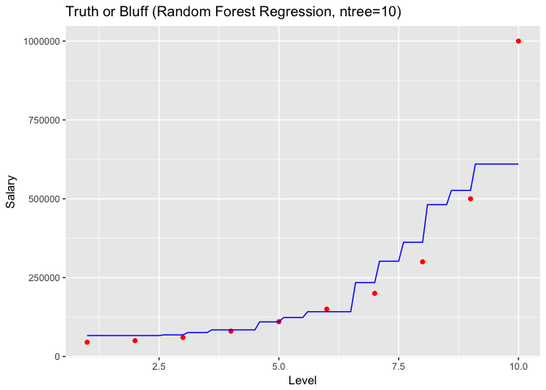
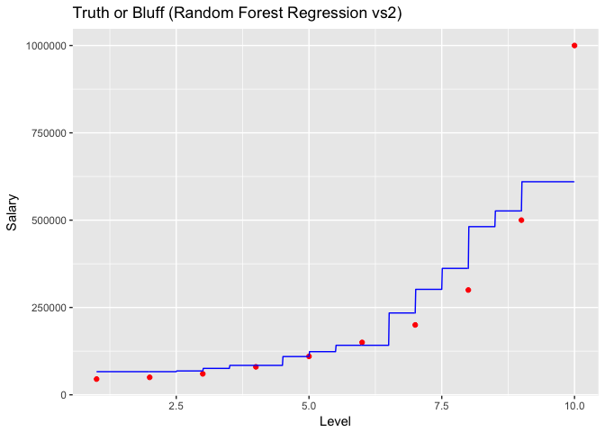
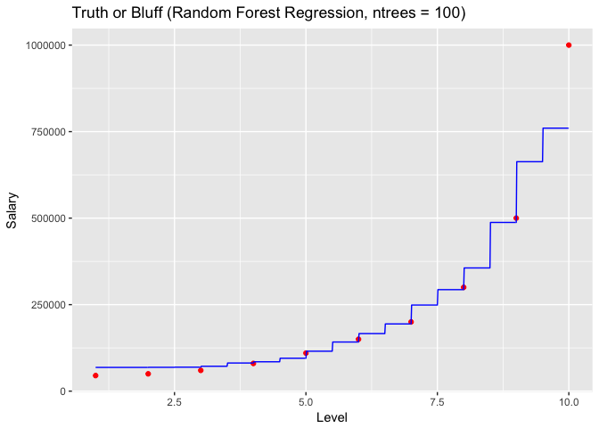
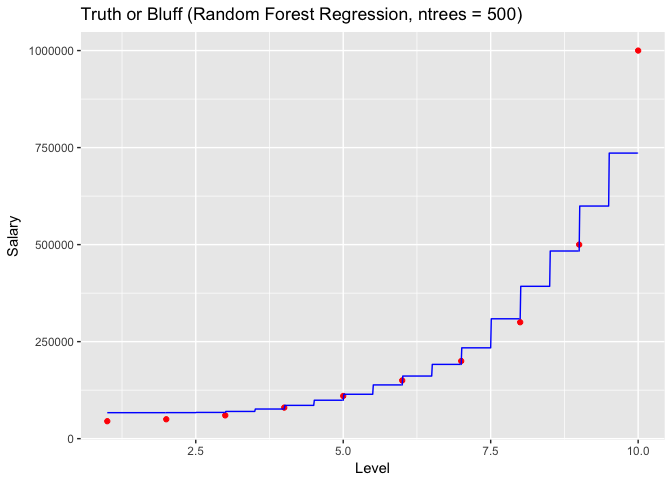

# Random Forest Regression


### Regression - Theory
Regression models (both linear and non-linear) are used for predicting a real value, like salary for example. If your independent variable is time, then you are forecasting future values, otherwise your model is predicting present but unknown values. Regression technique vary from Linear Regression to SVR and Random Forests Regression.

Machine Learning Regression models:

* Simple Linear Regression
* Multiple Linear Regression
* Polynomial Regression
* Support Vector for Regression (SVR)
* Decision Tree Classification
* Random Forest Classification

### Random Forest Regression  - Theory
Random Forest is a version of Ensemble Learning
Random Forest = Team of Decision Tree Regression, each making a prediction --> average of all trees; 
non-continouos regression model

* Pros: Powerful and accurate, good performance on many problems, including non linear
* Cons: No interpretability, overfitting can easily occur, need to choose the number of trees

### Business Problem (Udemy)

Interview Situation: Applicant states he earned 160.000 / year
HR received table with salaries per level
HR wants to predict salary of an employee with level 6.5 and find out if applicants claim is realistic

# Importing the dataset:

```r
dataset = read.csv('Position_Salaries.csv')
dataset = dataset[2:3]
```

Fitting Random Forest Regression to the dataset:

```r
library(randomForest)
set.seed(1234) 
regressor = randomForest(x= dataset[1],
                         y= dataset$Salary,
                         ntree = 10)
# x is expected to be a dataframe --> use []
# y is expedted to be a vector --> use $
```

Predicting a new result:

```r
y_pred = predict(regressor, data.frame(Level = 6.5))
y_pred
```

```
##        1 
## 141733.3
```

Visualising the Regression Model results (for higher resolution and smoother curve):

```r
library(ggplot2)
x_grid = seq(min(dataset$Level), max(dataset$Level), 0.1)
ggplot() +
  geom_point(aes(x = dataset$Level, y = dataset$Salary), colour = 'red') +
  geom_line(aes(x = x_grid, y = predict(regressor, newdata = data.frame(Level = x_grid))), colour = 'blue') +
  ggtitle('Truth or Bluff (Random Forest Regression, ntree=10)') +
  xlab('Level') +
  ylab('Salary')
```

<!-- -->


```r
# Increase resolution
x_grid = seq(min(dataset$Level), max(dataset$Level), 0.01)
ggplot() +
  geom_point(aes(x = dataset$Level, y = dataset$Salary), colour = 'red') +
  geom_line(aes(x = x_grid, y = predict(regressor, newdata = data.frame(Level = x_grid))), colour = 'blue') +
  ggtitle('Truth or Bluff (Random Forest Regression vs2)') +
  xlab('Level') +
  ylab('Salary')
```

<!-- -->

```r
# more steps in stairs with more trees / more intervals 
```


```r
# Increase ntrees to 100
regressor = randomForest(x= dataset[1],
                         y= dataset$Salary,
                         ntree = 100)

x_grid = seq(min(dataset$Level), max(dataset$Level), 0.01)
ggplot() +
  geom_point(aes(x = dataset$Level, y = dataset$Salary), colour = 'red') +
  geom_line(aes(x = x_grid, y = predict(regressor, newdata = data.frame(Level = x_grid))), colour = 'blue') +
  ggtitle('Truth or Bluff (Random Forest Regression, ntrees = 100)') +
  xlab('Level') +
  ylab('Salary')
```

<!-- -->

Predicting results:

```r
y_pred = predict(regressor, data.frame(Level = 6.5))
y_pred
```

```
##        1 
## 166281.7
```


```r
# Increase ntrees to 500
regressor = randomForest(x= dataset[1],
                         y= dataset$Salary,
                         ntree = 500)

x_grid = seq(min(dataset$Level), max(dataset$Level), 0.01)
ggplot() +
  geom_point(aes(x = dataset$Level, y = dataset$Salary),
             colour = 'red') +
  geom_line(aes(x = x_grid, y = predict(regressor, newdata = data.frame(Level = x_grid))),
            colour = 'blue') +
  ggtitle('Truth or Bluff (Random Forest Regression, ntrees = 500)') +
  xlab('Level') +
  ylab('Salary')
```

<!-- -->

Predicting results:

```r
y_pred = predict(regressor, data.frame(Level = 6.5))
y_pred
```

```
##      1 
## 161338
```
Prediction seems to be improving with the increase of ntrees.
